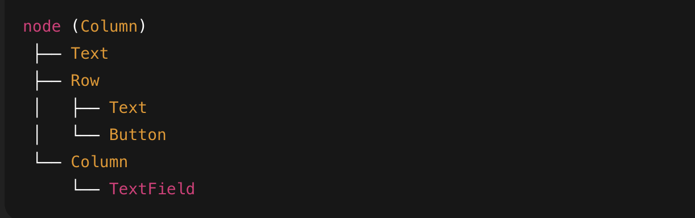

# NativeSpec Schema

This repository defines the JSON schema for NativeSpec UI.

NativeSpec is a schema-first system for describing native UI
using JSON, rendered by platform-specific libraries such as:
- native-spec-android (Jetpack Compose)
- native-spec-ios (SwiftUI)

This repository contains:
- The official JSON Schema (v1)
- Component definitions
- Example UI JSON files

## Below is the layout hierarchy of layout

⚠️ This repository does NOT contain runtime code.
